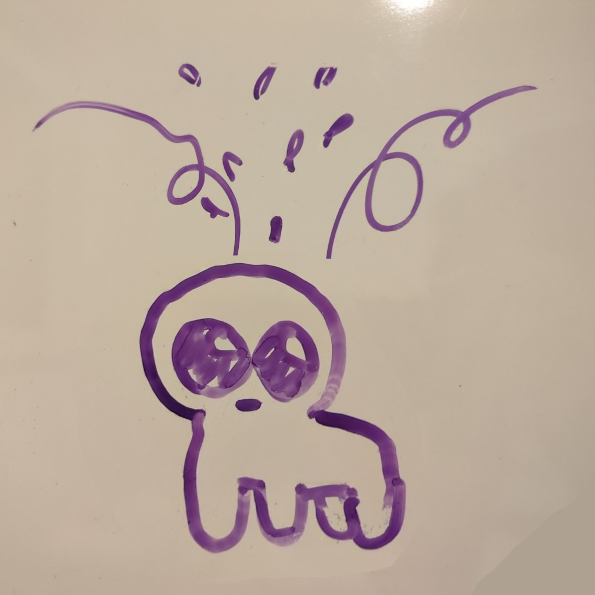

+++
sort_by = "date"
+++

Hi there! Depending on where you look, I go by **mei** or **Maja Kądziołka**.
I'm a queer weirdo who's into computers; currently an undergraduate student
at the University of Warsaw.
Following my contribution to the [BB(5) collaboration](#publications),
I'm looking for a place for myself in academia.





My research interests include:
- automata theory, with a recent focus on Vector Addition Systems
  and related models,
- metatheory of dependent types, with a focus on unresolved theoretical
  questions underlying
  existing implementations, as well as on features which would enable
  usability improvements in proof assistants,
- formalization of undecidability and computational complexity results
  within interactive theorem provers,
- computational combinatorics,
- constructive mathematics,
- automated static analysis of machine code, with applications
  in reverse-engineering tooling, and
- theoretical foundations of the Rust programming language.

I've been known to have a soft spot in my heart for [e-graphs] — legend has it
I'm always on the look out for reasons to use one.

In the long term, I have the following primary goals:

- help push forwards the correctness guarantees we can make at
  the bedrock layers of computing, by building formally verified compilers,
  proof assistant kernels,
  operating systems, hypervisors, language runtimes, and hardware;
- improve the usability of proof assistants,
  to allow for their adoption by a wider group of professionals,
  make existing users more productive,
  as well as to make them a feasible medium for learning materials
  in mathematics and computer science.

[e-graphs]: https://egraphs.org/

## Publications

- The bbchallange Collaboration.
  **[Determination of the fifth Busy Beaver value][bb5-preprint]**, STOC 2026.
  [[pre-print pdf][bb5-preprint-pdf]] [[conference pdf][bb5-stoc26]]

[bb5-preprint]: https://arxiv.org/abs/2509.12337
[bb5-preprint-pdf]: https://arxiv.org/pdf/2509.12337
[bb5-stoc26]: /pubs/bb5-stoc26.pdf

## Contact

- email: literally anything @ this domain.
- Matrix: @meithecatte:badat.dev
- fedi: [@mei@donotsta.re](https://donotsta.re/mei)
- Signal: [mei.1312][signal-link]

[signal-link]: https://signal.me/#eu/NBV6EZkuU31Xkl9OWnX-8qxltMUrFQpjrz9MTCG9cs9nyWiAu9JF0aYR8Yrm6edR

## Blog
