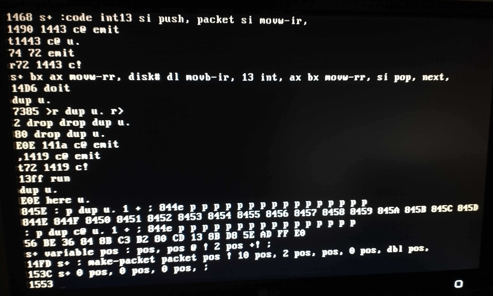

+++
title = "No branches? No problem — a Forth assembler"
date = "2021-06-22"
+++

The set of words available after Miniforth boots is quite bare-bones. One
reader even [claimed][reddit-guy] that, since there's no branches, it is not
Turing-complete, and therefore not worthy of being called a Forth! Today is the
day we prove them wrong. <!-- more -->

In the [previous post], I described the bootsector-sized core of Miniforth, with
all the clever optimizations I've had to use to fit it in. To recap, the
following words are available:

```
+ - ! @ c! c@ dup drop swap emit u. >r r> [ ] : ; load s:
```

Most of those will be familiar to Forth programmers, but `load` and `s:` might
need some comment. `load ( u -- )` is [a standard word][std-load] from the
optional Block word set — it loads block `u` and executes it as Forth source
code.[^load-difference] This word is crucial for practical use of such a small
Forth, as once you bootstrap far enough, you can save your code to disk, and
after a reboot, resume with just `1 load`.

To get to that point, however, you need to write quite a bit of code. To make
the source code available in memory once you can save it, I included
`s: ( buf -- buf+len )`, which is essentially a string poke — the rest of the
input buffer is copied to `buf`. The address of the end of the buffer is
left on the stack, such that you can use `s:` on the next line, and the result
will be concatenated.

In this post, we will start from the state Miniforth boots up in, and:

 - [write a Forth-style assembler,](#forth-style-assemblers)
 - [bootstrap the ability of writing to disk,](#disk-i-o) and
 - [use our assembler to implement branches.](#branches)

This is not to say that this is the only way. I do have a pure-Forth
implementation of branches on top of Miniforth, and I intend to talk about it
more in about a week — meanwhile, I encourage you to try figuring it out on your
own. I'm really curious how many different approaches there are.

Meanwhile, let's explore the approach that *doesn't* discard most of the
performance in the name of purity. For reference and easy experimentation, the
code from this post is [available on GitHub][github]. When explaining the code,
I'll sometimes add comments, but since we didn't implement any comment
handling yet, they aren't actually there in the code.

## `s:` — the workflow

I've decided to keep my source code at address `1000`, in the space between the
parameter and return stacks. The first thing we'll need is a way of running the
code we put there. The `InputPtr` is defined to be at `A02`, so let's define
`run`, which pokes a value of our choice at that address:

```forth
: >in A02 ;  : run >in ! ;
```

`>in` is a traditional name for the input buffer pointer, so I went with
that.[^to-in] To make sure it is also available on subsequent boots, I save this
piece of code in memory:

```forth
1000 s: : >in A02 ;  : run >in ! ;
```

This is a good time to peek at the current pointer to the source buffer, with
`dup u.`. Unless you added some writespace, the answer will be `101A`, and this
is the address we will want to pass to `run` later on, to avoid redefining `>in`
and `run`.[^redefine]

After writing enough code to want to test it, I would print the current address
of the buffer with `u.`, and then `run` the new code from the previous printed
buffer address. At first, it's important that the buffer address is not left at
the top of the stack, as Miniforth boots up [with the addresses of the built-in
system variables on the stack][variables], and we will want to access those.

## System variables

In fact, almost everything we want to do requires these variables, so let's take
care of that first — having to dig into the stack every time you need one of
these variables is unworkable. The stack starts out like this:

```
latest st base dp disk#
```

Normally, we would just do `constant disk#`, `constant here`, and so on.
However, we do not have `constant`, or any way of defining it (yet).
[`literal`][literal] is closer, but we'd need at least `here` to implement it
and `latest` to mark it as immediate. We can work around the immediate issue
with `[` and `]`, which suggests the following course of action:

```fth
swap : dp 0 [ dup @ 2 - ! ] ;
```

Let's go through this step by step, as the way this works is somewhat intricate.
`dp` stands for *data pointer*. It is the variable backing `here`, the
compilation pointer, meaning `here` is simply defined as

```fth
: here dp @ ;
```

When the code inside square brackets executes, our memory looks like this:


What we wish to do is put `dp` where the `0` currently is. Since we ran a `swap`
before defining our word, the address of `dp` is at the top of the stack. After
`dup @ 2 -`, we will have a pointer to the cell containing the `0`, and `!` will
overwrite it. As you can see, the `0` doesn't have any particular significance,
we could've used any literal.

Next up, we define `cell+` and `cells`. The reason I do it this early is that
one of the things I would eventually like to do is switch to 32-bit Protected
Mode, so as much code as possible should be cell-width agnostic.

```fth
: cell+ 2 + ;
: cells dup + ;
```

Also, since we now have `dp`, let's write `allot`. The functionality of
incrementing a variable can be factored out into `+!`:

```fth
: +! ( u addr -- ) dup >r @ + r> ! ;
: allot ( len -- ) dp +! ;
```

This allows defining `c,` and `,`, which write a byte or cell, respectively,
to the compilation area:

```fth
: c, here c! 1 allot ;
: , here ! 2 allot ;
```

Next, we will write `lit,`, which appends a literal to the current definition.
To do this, we need the address of `LIT`, the assembly routine that handles a
literal. We store it in the `'lit` "constant", with a similar trick to what we
did for `dp`:

```fth
: 'lit 0 [ here 4 - @ here 2 - ! ] ;
: lit, 'lit , , ;
```

This lets us easily handle the rest of the variables on the stack:

```fth
: disk# [ lit, ] ;
: base [ lit, ] ;
: st [ lit, ] ;
: latest [ lit, ] ;
```

I'm calling it `st` instead of `state`, because `state` should be a cell-sized
variable where true means compiling, and `st` is a byte-sized variable where
true means interpreting.

## Custom variables

If you're in the mood for mischief, you can create variables out of thin air by
simply mentioning them. The lack of error checking will turn them into a number,
essentially giving you a random address. For example, `srcpos u.` outputs
`DA9C`. Of course, you're risking that these addresses will collide, either with
one another, or with something else, such as the stack or the dictionary space.

I *wasn't* in the mood for mischief, so we'll do this properly. The core of any
defining word will be based on `:`, as that already parses a word and creates a
dictionary entry. We just need to go back to interpretation mode. `[` does that,
but it's an immediate word, and we can't define `postpone` yet, so let's define
our own variant that isn't immediate:

```fth
: [[ 1 st c! ;
```

We will also need a non-immediate variant of `;`. The only thing it needs to do
compile `exit`. We don't know the address of `exit`, but we can read it out of
the most recently compiled word:

```fth
here 2 - @ : 'exit [ lit, ] ;
```

For example, here's how we'd use it for `constant`:

```fth
: constant \ example: 42 constant the-answer
  : [[ lit, 'exit ,
;
```

`create` defines a word that pushes the address directly afterwards. The typical
use is

```fth
create some-array 10 cells allot
```

To calculate the address we should compile, we need to add `3 cells` — one for
each of `LIT`, the actual value, and `EXIT`.

```fth
: create : [[ here 3 cells + lit, 'exit , ;
```

`variable`, then, simply `allot`s one cell:

```fth
: variable create 1 cells allot ;
```

## Improving on `s:`

So far, the pointers passed to `s:` and `run` have had to be managed manually. It's
a simple process, though, so let's automate it. `srcpos` will contain the
current end of the buffer, and `checkpoint` will point at the part that hasn't
been ran yet.


```fth
variable checkpoint
variable srcpos
```

The automatic variant of `s:` is called `s+`:

```fth
: s+ ( -- ) srcpos @ s: dup u. srcpos ! ;
```

We also print the new pointer. This has two uses:
- if you make a typo and want to correct, you can just read the approximate
  address where you need to poke around;
- we need to make sure that no definition straddles a kilobyte boundary, so that
  our buffer can be directly written into blocks.

The pending portion of the buffer can be executed with `doit`:

```fth
: move-checkpoint ( -- ) srcpos @ checkpoint ! ;
: doit ( -- ) checkpoint @ run move-checkpoint ;
```

Setting this up amounts to something like

```fth
1234 srcpos ! move-checkpoint
```

This line is not written to disk, as the exact address is not going to be useful
after a reboot.

## Forth-style assemblers

The usual syntax of assembly looks like this:

```asm
    mov ax, bx
```

If we wanted to handle *that*, we'd need to write a fancy parser, and there's no
way we're going to be able to do that without branches. Let's adjust the syntax
for our uses instead — if AT&T is allowed to do that, so can we. To be specific,
let's make each instruction a Forth word, passing the arguments through the
stack:

```fth
    bx ax movw-rr,
```

I chose to order the arguments as `src dst instr,`, with the data flowing
left-to-right. This is consistent with how data flows in normal Forth code, and
is an exact mirror of Intel's syntax.  After a dash, I include the types of the
arguments, in the same order — register (`r`), memory (`m`), or immediate (`i`).
Finally, instructions that can be both byte and word-sized have a `b` or `w`
suffix, like in AT&T syntax.

Note that having to specify the operand types manually isn't a fundamental
limitation of Forth assemblers. Usually, nothing prevents building in more
smarts into these words to pick the right variant based on the operands
automatically. However, in this particular case, we don't have any branching
words (as they are our goal :smile:).

## x86 instruction encoding

The simplest to encode are the instructions that don't take any arguments. For
example,

```fth
: stosb, AA c, ;  : stosw, AB c, ;  : lodsb, AC c, ;  : lodsw, AD c, ;
```

Next simplest are instructions that include *immediates* — numeric arguments
that come *immediately* after the opcode:

```fth
: int, CD c, c, ;
```

Some instructions use a bitfield in their opcode byte. For example, an immediate
load such as mov cx, 0x1234` encodes the register in the lower 3 bits of the
opcode:


The registers map to the following numeric values:

```fth
: ax 0 ;  : cx 1 ;  : dx 2 ;  : bx 3 ;  : sp 4 ;  : bp 5 ;  : si 6 ;  : di 7 ;
```

You read that right, it goes `AX CX DX BX`. As far as I know, this is not
because somebody at Intel forgot their ABC's, but because the etymology of these
register names goes something like "**A**ccumulator, **C**ounter, **D**ata,
**B**ase", and the fact that they're the first four letter is just a
coincidence. Or that's the jist of it, anyway. [This retrocomputing.SE
post][acdb] includes some speculations on how it could be beneficial to the
hardware design, but no hard facts.

The corresponding numbering for byte-sized registers looks like this:

```fth
: al 0 ;  : cl 1 ;  : dl 2 ;  : bl 3 ;  : ah 4 ;  : ch 5 ;  : dh 6 ;  : bh 7 ;
```

Thus, we can encode some `mov`s:

```fth
: movw-ir, B8 + c, , ;
: movb-ir, B0 + c, c, ;
```

These can be used like so:

```fth
ACAB bx movw-ir,
42 al movb-ir,
```

Note that it is the responsibility of the user to use an 8-bit register with
`movb`, and a 16-bit register with `movw`.

Some other instructions that are encoded in this way are `incw/decw` and
`push/pop`:

```fth
: incw, 40 + c, ;
: decw, 48 + c, ;
: push, 50 + c, ;
: pop,  58 + c, ;
```

## ModR/M

The most complex instructions we'll have to deal with make use of the *ModR/M*
byte. This is the encoding mechanism responsible for instructions like `add ax,
[bx+si+16]`, but also ones as simple as `mov ax, bx`.

The opcode itself specifies a pattern, such as `mov r16, r/m16`. In this case,
it means that the destination is a register and the source is either a register
or the memory. The ModR/M byte, which comes after the opcode, specifies the
details of the operands:


The three bits in the middle specify the `r16` part, while the rest specifies
the `r/m16` part, according to this table:

<div style="font-family: monospace; font-size: 85%;">

| reg/[regs] field | mod: 00 | mod: 01    | mod: 10     | mod: 11 |
|-----------------:|---------|------------|-------------|---------|
|                0 | [BX+SI] | [BX+SI+d8] | [BX+SI+d16] | AL/AX   |
|                1 | [BX+DI] | [BX+DI+d8] | [BX+DI+d16] | CL/CX   |
|                2 | [BP+SI] | [BP+SI+d8] | [BP+SI+d16] | DL/DX   |
|                3 | [BP+DI] | [BP+DI+d8] | [BP+DI+d16] | BL/BX   |
|                4 | [SI]    | [SI+d8]    | [SI+d16]    | AH/SP   |
|                5 | [DI]    | [DI+d8]    | [DI+d16]    | CH/BP   |
|                6 | [d16]   | [BP+d8]    | [BP+d16]    | DH/SI   |
|                7 | [BX]    | [BX+d8]    | [BX+d16]    | BH/DI   |

</div>

As you can see, if the *mod* field is set to `3`, then the lower 3 bits just
encode another register, in the same order as before. Otherwise, we choose one
of the eight possibilities for address calculation, with an optional offset
that can be either 8 or 16 bit. Said offset comes directly after the ModR/M
byte, and is sign-extended to 16 bits if necessary.

There is one irregularity, in that if we try to encode a `[BP]` without any
offset, what we get instead is a hardcoded address, such as `mov bx, [0x1234]`,
which should come after the ModR/M byte itself.[^modrm-order] If you recall, the
lack of `[BP]` is why switching the return stack to use `DI` instead was
beneficial.

A peculiar aspect of this encoding is that register-to-register operations can
be encoded in two different ways. Let's take `xor cx, dx`, for example:


Anyway, let's implement this. First, the register-to-register variant. I chose
to name the word for compiling such a ModR/M byte `rm-r,`, meaning that there is
a `r`egister in the field that could also be `m`emory, followed by another
`r`egister. We don't have any bitshifts, but we can work around that with
repeated addition:

```fth
: 2* dup + ;
: 3shl 2* 2* 2* ;
: rm-r, ( reg-as-r/m reg -- ) 3shl + C0 + c, ;
```

When using `rm-r,`, we need to make sure that the opcode used is the one with
the `r/m16, r16` template — we would need to `swap` the two registers otherwise:

```fth
: movw-rr, 8B c, rm-r, ;
: addw-rr, 03 c, rm-r, ;
: orw-rr, 0B c, rm-r, ;
: andw-rr, 23 c, rm-r, ;
: subw-rr, 2B c, rm-r, ;
: xorw-rr, 33 c, rm-r, ;
: cmpw-rr, 3B c, rm-r, ;
```

Memory-to-register variants aren't much harder. We define the addressing modes,
just like we did for registers.

```fth
: [bx+si] 0 ;  ; [bx+di] 1 ;  ; [bp+si] 2 ;  ; [bp+di] 3 ;
: [si] 4 ;  ; [di] 5 ;  ; [#] 6 ;  ; [bp] 6 ;  ; [bx] 7 ;
```

`[#]` is the absolute address mode, which should be used by assembling the
address manually after the instruction, for example

```fth
[#] ax movw-mr, some-addr ,
```

I also include `[bp]`, which collides with `[#]`, as the address mode words can
be shared with the `[??+d8]` and `[??+d16]` modes.

Analogously to `rm-r,` we have `m-r,`:

```fth
: m-r, ( mem reg -- ) 3shl + c, ;
```

`r-m,` is the same, just swap the operands:

```fth
: r-m, ( reg mem -- ) swap m-r, ;
```

There is no need to define every instruction with memory operands, just `mov`s
are enough:

```fth
: movw-mr, 8B c, m-r, ;
: movw-rm, 89 c, r-m, ;
```

There is also one slightly different use of the ModR/M byte. Namely, if an
instruction only needs one operand (such as `not bx` or `jmp ax`), only the
`r/m` one is actually used. In that case, the register field is instead reused
as more bits for the opcode itself.

The notation used by Intel's manual for this is `opcode /regbits`. For example,
an indirect jump is `FF /4`, while an indirect call is `FF /2`, sharing the
main opcode byte. We can encode instructions like these by simply pushing the right
value before calling `rm-r,`.

```fth
: jmp-r, FF c, 4 rm-r, ;
: notw-r, F7 c, 2 rm-r, ;
```

To actually assemble a primitive word, we'll also need a way of creating its
header.  The simplest way to do that is to call the normal `:`, and then rewind
`dp` by three bytes, to remove the call to `DOCOL`:

```fth
: :code : [[ here 3 - dp ! ;
```

To finish such a definition, we compile a `NEXT`:

```fth
: next, lodsw, ax jmp-r, ;
```

Note that `next,` is not defined with `:code` — it is the equivalent of an
assembler macro.

As an example of a simple assembled primitive, let's look at the implementation
of `1+`:

```fth
:code 1+ bx incw, next,
```

## Disk I/O

This is actually enough to write our work to disk. Just like the implementation
of `load`, we'll need to create a disk address packet, and then call `int 0x13`.
One primitive word can serve for both reading and writing, as the only
difference is the value of `AX` you need. It is crucial to preserve `SI` — I've
had the [displeasure of learning this empirically][int13-crash].

```fth
create packet 10 allot
:code int13
  si push,              \ push si
  packet si movw-ir,    \ mov si, packet
  bx ax movw-rr,        \ mov ax, bx
  disk# dl movb-ir,     \ mov dl, disk#
  13 int,               \ int 0x13
  ax bx movw-rr,        \ mov bx, ax
  si pop,               \ pop si
next,
```

Note that we're saving the returned value of `AX` back on the stack. This is
because a non-zero `AH` value signals an error.

To fill the `packet` with data, I'm using a variant of `,` that writes to a
controlled location instead of `here`:

```fth
variable pos
: pos, ( val -- ) pos @ ! 2 pos +! ;
: make-packet ( block buffer -- )
  packet pos !
  10 pos, \ size of packet
  2 pos,  \ sector count
  pos, 0 pos, \ buffer address
  2* pos, 0 pos, 0 pos, 0 pos, \ LBA
;
```

For reading, we use `AH = 0x42`, as before. Writing uses `AH = 0x43`, but in
that case the value of `AL` controls whether we want the BIOS to verify the
write — we do, so I've set it to `0x02`.

```fth
: read-block make-packet 4200 int13 ;
: write-block make-packet 4302 int13 ;
```

## Precautions

It would be nice to verify that our new code was assembled correctly before
running it. Ideally, we'd write a little hexdump utility, but we still don't
have any way to loop. There is a way around that, though — just type in the word
you need many times in a row:

```fth
: p ( buf -- buf+1 ) dup c@ u. 1 + ;
\ later...
here 10 - p p p p p p p p p p p p p p p p drop
```

Another good sanity check is to make sure that nothing we weren't expecting has
been pushed onto the stack — those are usually caused by undefined words being
badly turned into numbers. The way to do this is `dup u.` — an empty stack will
result in a response of `E0E`, stemming from a benign stack underflow we've just
caused. One example of a bug this has once caught is a typo, where I had typed
`movb-it,` instead of `movb-ir,`.



The first disk access I tried was `0 4000 read-block u. 41fe @ u.`. This shows the
`AA55` magic number at the end of the bootsector. I then wrote my source code to
blocks 1 and 2, and read them into a separate buffer to make sure it worked. In
hindsight, it might've been a good idea to read a block other than 0 before
attempting a write, to make sure that providing the LBA is working properly.
Thankfully, this particular bug was purely hypothetical.

I also wrote the same data to blocks 0x101 and 0x102. That way, I can recover if I
ever break booting from the usual block numbers.

## Jumps

Before we tackle implementing branches, we'll need one more instruction — the
conditional jump. On x86, the jump offsets are encoded as a signed value
relative to the current instruction pointer. There are different encodings for
different bit widths of this value, but we'll only need the shorter 8-bit one.

To be specific, the value is relative to the *end* of the jump instruction, so
that it matches the number of skipped bytes in the case of forward jumps:


To assemble the jump distances, I use two pairs of words — one for forward
jumps, and one for backward ones:

```fth
jnz, j> ... >j \ forward jump
j< ... jnz, <j \ backward jump
```

The rule is that the arrows show the direction of the jump, and the arrows must
be "inside" — in other words, if you got the two words next to each other, these
arrows should fit like a glove. The two words simply communicate through the
stack. For example, `j<` will simply remember the current location:

```fth
: j< here ;
```

This is then consumed by `<j`, which subtracts the current position and compiles
the offset:

```fth
: <j here 1 + - c, ;
```

For forward jumps, we compile a dummy offset, to rewrite it later:

```fth
: j> here 0 c, ;
: >j dup >r 1 + here swap - r> c! ;
```

Finally, the jump instructions themselves. Some of the jumps have multiple
names. For example, since the carry flag gets set when a subtraction needs to
borrow, a `jc` has exactly the same behavior as the unsigned comparison `j`ump
if `b`elow. The same applies to `je` and `jz`, but that's intuitive enough for
me, so I didn't feel the need to define both names.

```fth
: jb, 72 c, ;  ; jc, 72 c, ;  ; jae, 73 c, ;  ; jnc, 73 c, ;
: jz, 74 c, ;  ; jnz, 75 c, ;  ; jbe, 76 c, ;  ; ja, 77 c, ;
: jl, 7C c, ;  ; jge, 7D c, ;  ; jle, 7E c, ;  ; jg, 7F c, ;
```

## Branches

When compiled into a definition, branches look like this:


By convention, words that get compiled into a definition but aren't used
directly have their names wrapped in parentheses, so our branches are called
`(branch)`, which is unconditonal, and `(0branch)`, which pops a value off the
stack and branches if it's zero.

We can read the branch target out of the pointer sequence with `lodsw`:

```fth
:code (branch)
  lodsw,           \ lodsw
  ax si movw-rr,   \ mov si, ax
next,
```

In the case of the conditional branch, it is important to remember to always
read (or skip) the branch target, regardless of whether the branch condition is
true.

```fth
:code (0branch)
  lodsw,           \ lodsw
  bx bx orw-rr,    \ or bx, bx
  jnz, j>          \ jnz .skip
  ax si movw-rr,   \ mov si, ax
>j               \ .skip:
  bx pop,          \ pop bx
next,
```

To handle branch offset computation, I use a very similar set of words to the
ones used by jumps. The implementation is simpler, though, since the encoding
isn't relative to the current position:

```fth
: br> here 0 , ;
: >br here swap ! ;
: br< here ;
: <br , ;
```

## Control flow

To make the logic that compiles `if`s actually run at compile time, we need to
mark these words as immediate. To do that, we use `immediate`, which sets the
immediate flag of the most recently compiled word:

```fth
: immediate ( -- )
  latest @      \ get pointer to word
  cell+         \ skip link field
  dup >r c@     \ read current value of the length+flags field
  80 +          \ set the flag
  r> c!         \ write back
;
```

We'll also need `compile`, which, when invoked as `compile x`, appends `x` to
the word currently being compiled. We don't actually need to make it an
immediate word which parses the next word by itself, simply reading out the
address of `x` like `lit` or `(branch)` do it is enough:

```fth
: compile r> dup cell+ >r @ , ;
```

`if` is simply a conditional forward branch:

```fth
: if compile (0branch) br> ; immediate
: then >br ; immediate
```

`else` is a bit more complicated. We need to compile an unconditional branch
jumping to the `then`, but also resolve `if`'s jump to point just after the
unconditional jump. I like using the return stack manipulation words for this,
as the arrows match the ones used by `>br` and make the code easier to read:

```fth
: else >r compile (branch) br> r> >br ; immediate
```

Next, we need loops. Firstly, the simple `begin ... again` infinite loop:

```fth
: begin br< ; immediate
: again compile (branch) <br ; immediate
```

`begin ... until` isn't much harder — just use a conditional jump at the end:

```fth
: until compile (0branch) <br ; immediate
```

Lastly, Forth's unique `begin ... while ... repeat` loop, where the loop
condition is in the middle of the loop:


```fth
: while ( backjmp -- fwdjmp backjmp )
  compile (0branch) br> swap
; immediate
: repeat ( fwdjmp backjmp -- )
  compile (branch) <br >br
; immediate
```

## Comparisons

Branching is not that useful without any way to compare things. One common concern
among all comparison words is turning a processor flag into a Forth boolean.
Recall that, in Forth, booleans have all bits either set or unset:

```fth
: false 0 ;
: true FFFF ;
```

I chose to generate these booleans by first setting `ax` to 0, and then possibly
decrementing it based on the result of the comparison. This code can be factored
out as follows:

```fth
: :cmp :code ax ax xorw-rr, ;
: cmp; j> ax decw, >j ax bx movw-rr, next, ;
```

Then, to define a comparison, you just need to compile a jump that will be taken
when the result should be false:

```fth
:cmp 0= bx bx orw-rr, jnz, cmp;
:cmp 0<> bx bx orw-rr, jz, cmp;
:cmp 0< bx bx orw-rr, jge, cmp;
:cmp 0<= bx bx orw-rr, jg, cmp;
:cmp 0> bx bx orw-rr, jle, cmp;
:cmp 0>= bx bx orw-rr, jl, cmp;
:cmp = cx pop, bx cx cmpw-rr, jnz, cmp;
:cmp <> cx pop, bx cx cmpw-rr, jz, cmp;
:cmp u< cx pop, bx cx cmpw-rr, jae, cmp;
:cmp u<= cx pop, bx cx cmpw-rr, ja, cmp;
:cmp u> cx pop, bx cx cmpw-rr, jbe, cmp;
:cmp u>= cx pop, bx cx cmpw-rr, jb, cmp;
:cmp < cx pop, bx cx cmpw-rr, jge, cmp;
:cmp <= cx pop, bx cx cmpw-rr, jg, cmp;
:cmp > cx pop, bx cx cmpw-rr, jle, cmp;
:cmp >= cx pop, bx cx cmpw-rr, jl, cmp;
```

For more complex conditions, we have the typical logical operators. As long as
we're using well-formed booleans, there is no need to distinguish a separate set
of purely logical operators — the bitwise ones work just fine.

```fth
:code or ax pop, ax bx orw-rr, next,
:code and ax pop, ax bx andw-rr, next,
:code xor ax pop, ax bx xorw-rr, next,
:code invert bx notw-r, next,
```

## Yay, loops! What now?

So far, many words that could improve the workflow of editing the code in memory
just weren't possible to define, as they inherently use a loop. This changes
now. Firstly, let's define `type`, which prints a string:

```fth
: type ( addr len -- )
  begin dup while 1 - >r
    dup c@ emit 1 +
  r> repeat drop drop
;
```

In my current workflow, the most recently defined block is terminated with a
null byte. Finding this location is necessary to append things to that block.
This is what `seek` does:

```fth
: seek ( addr -- end-addr ) begin dup c@ 0<> while 1 + repeat ;
```

It is then used by `appending` to set the `srcpos` and `checkpoint`
appropriately:

```fth
: appending ( addr -- ) seek dup u. srcpos ! move-checkpoint ;
```

Another useful thing is the ability to show the contents of a block and quickly
estimate the address of a specific point in the code — as we don't have any real
code editor, this is the first step of any patching endeavour. I chose to
display the blocks in the typical 64-by-16 format, even though my blocks aren't
formatted in any way and tokens often span such linebreaks.

Instead of line numbers, I print the address each line starts at. This is both
easier to implement and more useful. First, we have `show-line`, which shows a
single line:

```fth
\ cr emits a linebreak
: cr 0D emit 0A emit ;

40 constant line-length
10 constant #lines
: show-line ( addr -- next-addr )
  dup u.                    \ line number
  dup line-length type cr   \ line contents
  line-length +
;
```

This is then called 16 times in a loop by `list`. Since we don't yet have
`do`-`loop`, this is quite involved.

```fth
: list ( addr -- )
  #lines begin
    >r show-line r>
  1 - dup 0= until
  drop drop
;
```

Sometimes, we need to move some code around. For that, we'd need `move`. It is
like C's `memmove`, in that it copies the data from the right end, so that the
result is right even when the source and destination overlap. We'll implement
this with x86's `rep movsb` instruction, which is basically an entire `memcpy`
in one instruction. Let's teach the assembler about the rest of the string
instructions while we're at it:

```fth
: rep, F2 c, ;
: movsb, A4 c, ;  ; movsw, A5 c, ;  ; cmpsb, A6 c, ;  ; cmpsw, A7 c, ;
```

This is then used by `cmove`, which copies data forwards.[^cmove] This wrapper is
somewhat long, as we need to save the values of `si` and `di`.

```fth
:code cmove ( src dest len -- )
  bx cx movw-rr,
  si ax movw-rr, di dx movw-rr,
  di pop, si pop,
  rep, movsb,
  ax si movw-rr, dx di movw-rr,
  bx pop,
next,
```

Next, we'll need `cmove>`, which starts from the end of the buffers and copies
backwards. The arrow `>` indicates that this is the right word to use if the
data is to be moved towards a higher address, i. e. to the right. To run such a
copy, we run `rep movsb` with x86's direction flag enabled. This expects the
registers to contain the addresses of the *ends* of the buffers, so we run the
copy itself in `(cmove>)`, and then the actual `cmove>` is responsible for
calculating the right address.

```fth
: cld, FC c, ;  ; std, FD c, ;
:code (cmove>)
  bx cx movw-rr,
  si ax movw-rr, di dx movw-rr,
  di pop, si pop,
  std, rep, movsb, cld,
  ax si movw-rr, dx di movw-rr,
  bx pop,
next,
: cmove> ( src dest len -- )
  dup >r                  \ save length on return stack
  1 -                     \ we need to add len-1 to get the end pointer
  dup >r + swap r> + swap \ adjust the pointers
  r> (cmove>)
;
```

Finally, `move` compares the two addresses and chooses the appropriate copying
direction:

```fth
: over ( a b -- a b a ) >r dup r> swap ;
: move ( src dest len -- )
  >r
  over over u< if
    r> cmove>
  else
    r> cmove
  then
;
```

Implementing `fill` is similar, and it's useful for erasing any leftovers after
`move`s.

```fth
:code fill ( addr len byte -- )
  bx ax movw-rr,
  cx pop,
  di dx movw-rr, di pop,
  rep, stosb,
  dx di movw-rr,
  bx pop,
next,
```

Another issue when editing code is determining whether a specific word was
already written. To handle that, I wrote `words`, which prints the list of words
known to the system. Recall the structure of the dictionary:


Word headers contain the name as a counted string, meaning the first byte stores
the length. `count` takes a pointer to such a counted string, and turns it into
the typical `addr len` representation:

```fth
: count ( addr -- addr+1 len )
  dup 1+ swap c@
;
```

Given a pointer to a dictionary header, `>name` will extract the name out
of it:

```fth
1F constant lenmask
: >name ( header-ptr -- addr len )
  cell+     \ skip link pointer
  count lenmask and
;
```

We'll also need to check the hidden flag, as otherwise we'll encounter the
garbage names [introduced by our compression tricks][docol-compression].

```fth
: visible? ( header-ptr -- t | f )
  cell+ c@ 40 and 0=
;
```

Our last helper words are `space`, which simply prints a space, and `#bl` (stands
for *blank*), which is the constant that stores the ASCII value of the
space.[^bl-constant]

```fth
: #bl 20 ;
: space #bl emit ;
```

All of this is then used by `words-in`, which takes a pointer to the first word
in a list. This will make it easy to adapt once our Forth gains support for
vocabularies.[^vocab]

```fth
: words-in ( dictionary-ptr -- )
  begin dup while \ loop until NULL
    dup visible? if
      dup >name type space
    then
    @
  repeat
  drop ;
: words latest @ words-in ;
```

## Parsing

I will eventually need to replace the codegolfed outer interpreter with one
written in Forth. This will let me add things like proper handling of undefined
words, the familiar `ok` prompt, but also vocabularies and exception
handling.[^exceptions] The first step towards that is the `parse ( delim -- addr
len )` word, which will parse the input until a specified delimiter character is
encountered. For usual parsing, this would be a space, but if we set it to `)`,
we'll finally have comments.

`parse` stores the separator in a variable, so that helper words can use it.

```fth
variable sep
```

Parsing can end because we found a separator, or because we ran out of input,
which is signified by a NULL byte.

```fth
: sep? ( ch -- t | f ) dup 0= swap sep @ = or ;
```

After the parsing loop ends, we'll have a pointer to the separator. If it is a
true separator, we want to remove it from the input — after all, `)` does not
exist as a word. However, if we stopped because the input has ended, then we
must not advance past the null terminator. `+sep` handles this, and advances the
input pointer only if it doesn't point at a null byte.

```fth
: +sep ( ptr -- ptr' ) dup c@ 0<> if 1+ then ;
```

The loop in `parse` keeps two pointers on the stack. One doesn't move, and marks
the beginning of the token. The other is advanced in each iteration. At the end,
we save the moved pointer into `>in`, and then compute the length by subtracting
the two pointers.

```fth
: parse ( sep -- addr len )
  sep ! >in @ dup begin ( begin-ptr end-ptr )
    dup c@ sep? invert
  while 1+ repeat
  dup +sep >in !  \ update >in
  over -          \ compute length
;
```

This works when we want to parse a comment, but to parse a word, we actually
need to skip leading whitespace first. This is handled by `skip`, which also
takes the separator as an argument and advances `>in` so that it doesn't point at a
separator anymore.

```fth
: skip ( sep -- sep ) begin dup >in @ c@ = while 1 >in +! repeat ;
```

`token` combines the two.

```fth
: token ( sep -- addr len ) skip parse ;
```

This is then used by `char`, which returns the first character of the
following token — we can use this as character literals.

```fth
: char #bl token drop c@ ;
```

However, to include such a literal in a compiled word, we need `[char]`:

```fth
: [char] char lit, ; immediate
```

Finally, `(` is an immediate word that runs a `)`-delimited parse and discards
the result.

```fth
: ( [char] ) parse 2drop ; immediate
```

## Bare metal

Once the Miniforth bootsector was ready, I decided to do all my development and
testing on a bare metal computer. All in all, I don't regret this decision, but
getting to the point where I could save code on disk did take a few tries. I did
take photos of the code, though, so retrying only took typing in about a
kilobyte of source code again. A few attempts were ruined by typos made during
this transcription, but apart from that I did have two bugs worth mentioning.

The first time around, I tried implementing branches before writing to disk
itself. The branching code itself was perfectly fine, but my looping test
wasn't. Try spotting the mistake:

```fth
: foo begin dup u. 1 - 0= until ; 5 foo
```

<details>
<summary>Show hint</summary>

The code crashed like this:


</details>

<details>
<summary>Reveal solution</summary>

The `0=` consumes the loop counter on the stack, which means that each iteration
underflows further into the stack. Since there's no protection against this, the
code will be popping things until it starts overwriting code important enough
that it causes a crash.

</details>

The other bug was in the `int13` word itself. As I've alluded earlier, I forgot
to save SI, which is the execution pointer for the threaded code. It crashed as
soon as it ran `next`. Ironically, if I wasn't so cautious and ran a
`write-block` as my first operation, most of the code would've been saved
:upside_down_face:

Apart from bugs, there is another difficulty with running on bare metal: sharing
the code on GitHub. I solved this by writing a script, `splitdisk.py`, which
extracts the code out of a disk image. Since I'm booting off of a USB stick,
getting the code over doesn't take long.

Since there aren't any line breaks in there, I wrote a heuristic to split it
into a line per definition. Thanks to Python's `difflib`, it even preserves any
formatting adjustments made manually when extracting an updated version of a
block.

## What's next?

Now that we have branches, many things become available as the potential next
step. One important goal is to write a text editor, but some other improvements
to our Forth will probably have to come first.

Meanwhile, I encourage you to try bootstrapping on top of Miniforth up to
branching *without* using any additional assembled primitives. Not that there's
any merit to limiting yourself like that, but it *is* an interesting problem.
I'll explain my solution in a week's time, along with any substantially
different ones found by readers like you. I've created a [separate discussion
thread][asmless-discussion] for this problem, so please keep any spoilers out of
the comments below the article :slightly_smiling_face:

{{ get_notified() }}

---

[^load-difference]: There is a slight difference from the standardized behavior,
  in that my `load` merely repoints the input pointer, and the block will only
  actually execute once just before execution reaches the top-level REPL.

[^to-in]: It is now dawning on me that the reason it is usually called `>in` is
  that it is usually an offset (`>`) that gets added to a separate base address
  of the input buffer. Oh well.

[^redefine]: It's not like that would be a disaster, though. Rerunning the code
  like that is a normal occurence after a bugfix.

[^modrm-order]: If this was something like `mov [0x1234], 0x5678`, then the
  exact order used is: opcode, ModR/M, address, immediate.

[^cmove]: This is not the best name, as it is not what a C programmer would call
  a "move", but it is what the Forth standard uses, so I'll roll with it.

[^bl-constant]: It is now dawning on me that I could've defined it with
  `constant` instead. I'll probably change that when I bootstrap a proper text
  editor.

[^vocab]: Forth vocabularies, also known as wordlists, are a way segregating
  words into multiple separate 'dictionaries', which can be dynamically added
  and removed from the search order.

[^exceptions]: The exact aspect I'm concerned with is installing a top-level
  handler for exceptions that aren't caught. There's probably a way to make this
  particular aspect work without a new outer interpreter, but the other benefits
  are still there, so there isn't much point trying to figure this out.

[previous post]: @/bootstrap/miniforth/index.md
[primitives section]: @/bootstrap/miniforth/index.md#other-primitives
[variables]: @/bootstrap/miniforth/index.md#variables
[docol-compression]: /bootstrap/miniforth/#docol-compression
[std-load]: https://forth-standard.org/standard/block/LOAD
[literal]: https://forth-standard.org/standard/core/LITERAL
[reddit-guy]: https://www.reddit.com/r/Forth/comments/nxgg20/fitting_a_forth_in_512_bytes/h1eq4ok
[acdb]: https://retrocomputing.stackexchange.com/questions/5121/why-are-first-four-x86-gprs-named-in-such-unintuitive-order
[int13-crash]: https://twitter.com/NieDzejkob/status/1403443794842882055
[github]: https://github.com/NieDzejkob/miniforth/tree/post2
[twitter]: https://twitter.com/NieDzejkob
[tipjar]: https://github.com/sponsors/NieDzejkob
[asmless-discussion]: https://github.com/NieDzejkob/niedzejkob.p4.team/issues/2
