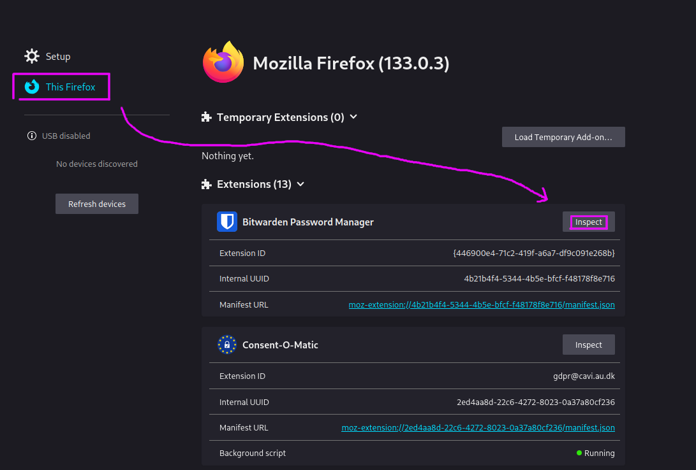
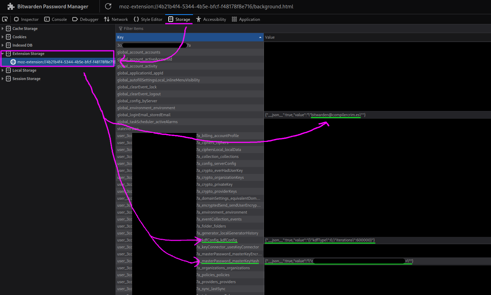

+++
title = "Bruteforcing the Bitwarden master password I forgor 💀"
date = "2026-02-13"
+++

The human mind is a fascinating thing. It's a miracle it works at all,
let alone how well it does. The corollary is that sometimes it doesn't,
I suppose. <!-- more -->

I've been using Bitwarden for a few years now.[^frens] My life had vastly changed
a few times over, and yet the master password I've been using has stayed
the same. I've almost stopped thinking about it, letting muscle memory
handle it for me.

One day, quite tired, I tried to unlock it like always, and the muscle memory
trigger failed me. I just typed in an entirely different password. Just like that,
the act of unlocking my password manager became an action that's to be handled
by the conscious brain now. And I found that I can't fully remember the passphrase
in question. Much like magnetic core memory or DRAM, neural memory reads are
— apparently — destructive, and when they happen in out-of-spec conditions,
your data can — apparently — kinda accidentally disappear.[^robo]

It wasn't all too bad. I quickly managed to reconstruct most of the passphrase,
but one word had somehow escaped me. I was pretty sure of the initial letter
and the vague semantic meaning, but I couldn't recall the word itself.

I wasn't too nervous. Since I was still *logged in* on all my devices, and the
password vault was merely *locked*, I could, at least in theory, easily do a local
bruteforce to bridge the gap.

The details were only a matter of some elbow grease and overcoming the procrastination.
At first I tried looking for people who've done a similar thing, but unfortunately
couldn't find any.[^search] So, in case this is useful for someone else later,
I decided to document the process.

## The devil's in the details

Knowing that I generated the password with [xkcdpass],[^xkcdpass] I found that
by default, the [`eff-long` wordlist][eff-long] must've been used, meaning 7776 options
for what the password could be. If I wanted to be fancy, I could try using
[word2vec] to sort the wordlist and incorporate the vague knowledge I still had
about the missing word, but that's very much not worth the effort when up
against mere 13 bits of entropy — even when key stretching is in your way.

The next step was to figure out where the Bitwarden client stores the data, and
how the relevant cryptography works. In my case, I was using the Firefox
browser extension — if you find yourself in a similar situation, but your setup
is different, then you're gonna have to be a bit more creative.

Since browser extensions are written in the typical combo of web technologies,
I deduced that there must be a way to open the browser dev tools in the context
of the extension.

However, looking for "open inspect element in context of web extension" is
kinda difficult. Search engines just seem to assume you're looking for some
extension for your browser that will "improve" your inspect element experience
in some way.[^ext-search]

But I managed to stumble through it and find it anyway. The relevant option is in `about:debugging`:[^remote-debug]



This lets you find all the necessary data:

[](bitwarden-data.png)

- the e-mail for the account, which is being used as the salt
- the `kdfConfig`, which specifies what algorithm is being used to hash the password and its parameters
- the `masterPassword_masterKeyHash`, which allows verifying if you have the right password

I created a file, `data.py`, in which I collected the pieces:

```python
masterKeyHash = "o<redacted>="
email = "bitwarden@compilercrim.es"
kdfType = 0
iterations = 600000
known = "known parts of the %s passphrase"
```

Next came spelunking through [the code][source] to find out how exactly the underlying
cryptography works. The relevant code entrypoint is [`verifyUserByMasterPassword`
in `user-verification.service.ts`][entrypoint]. The computation has two parts:

- first, the password goes through [key stretching] to derive the `masterKey`.
  This is handled by [`makeMasterKey`]. The underlying [`deriveKeyFromPassword`]
  can use either PBKDF2 or Argon2id, depending on the `kdfConfig`.
- the `masterKey` is then quickly hashed a further 2 iterations of `pbkdf2`,
  using the original password as a salt, and the result is compared with the stored
  `masterPassword_masterKeyHash` to decide whether the password is actually correct.

All in all, this looks like a reasonably typical approach. The key stretching helps
slow down brute-force attacks, and after the master key is calculated, we derive
a hash to check if the password is correct, without having to do weird things like
trying to decrypt random stuff just to see if the resulting plaintext looks vaguely okay.

But, two iterations of `pbkdf2` is quite a weird hash to use, don't you think? Why two?

## When the cryptographic spider sense is tingling

If you've taken a look at the code yourself, you'll have noticed that [`hashMasterKey`]
chooses between one and two iterations depending on the circumstances:

- two iterations are used to derive the `masterPassword_masterKeyHash` which gets used
  to check the password locally;
- on the other hand, one iteration is used to derive a hash that's used to authenticate
  with the Bitwarden server.

The goal here is to achieve [domain separation] — you wouldn't want to be able to use
the locally-stored hash to authenticate with the server. On the other hand, going the other
way probably isn't useful, so something like this should be fine, right?

Well, as far as domain separation goes, this is quite a crude way of achieving it. The `iterations`
parameter of PBKDF2 has not been designed for this, and the security of this approach depends on
the internals of PBKDF2.

For example, if you have the one-iteration and two-iteration hashes, does that let you check a password
guess without having to run the expensive key-stretching?

> But you might say, "when would that even matter? in what situation do you have both hashes, but
> not the password itself?"

Well, there *could* be a threat model where this matters. Consider the following scenario:

- a state actor wants your passwords
- they gain access to the Bitwarden server and capture the server-side hash when you authenticate
  (e.g. to sync the data with the server)
- then, they raid your home and grab your machines
- the vault happened to be locked, but the machines themselves were powered on, and so
  they get the local hash as well.

Does this let them perform the brute-force 600k times faster? Having stared at the
definition of PBKDF2 for a while, I determined that effectively, we get the following
relationship between the data:

```python
HMAC(masterKey, serverHash) ^ serverHash == localHash
```

So, if you have a guess for what the `masterKey` could be, you can check it quickly.
But that's pretty useless — you pretty much have no hope of guessing the `masterKey`,
other than by brute-forcing the password itself.

What saved the day here is that Bitwarden chose to compute the derived hashes
by invoking `PBKDF2(password: masterKey, salt: userPassword, iterations)`. Had they chosen
to write it as `PBKDF2(password: userPassword, salt: masterKey, iterations)`, we'd have
a cute little cryptographic backdoor... of an impact that, admittedly, depends on your
threat model.

> TL;DR: Please don't use the `iterations` parameter of your KDF to achieve domain separation.
> That's basically the cryptographic equivalent of playing with fire, and you only get to do that
> if you're setting a CTF challenge.
>
> Don't stress out your pet cryptographers.

## Back to the realm of the living

Having managed to climb out of the rabbit hole that once again swallowed me whole
the moment I briefly let my guard down, I whipped up a quick Python script
to actually do the thing I wanted to do in the first place, and brute force the
part of the password I had forgotten:

```python
from data import *
from base64 import *
from hashlib import pbkdf2_hmac
from xkcdpass import xkcd_password

wordfile = xkcd_password.locate_wordfile()
with open(wordfile) as f:
    wordlist = list(map(str.strip, f))

assert kdfType == 0 # PBKDF2_SHA256

salt = email.encode()
keyhash = b64decode(masterKeyHash)

for i, guess in enumerate(wordlist):
    if i % 10 == 0: print('#', i)
    password = (known % guess).encode()

    masterKey = pbkdf2_hmac('sha256', password, salt, iterations)
    masterKeyHash = pbkdf2_hmac('sha256', masterKey, password, 2)

    if masterKeyHash == keyhash:
        print(guess)
        break
```

I mentally prepared myself for it to fail the first couple times, since that's always how it is
when you're dealing with cryptography. Debugging that is always *fun*.

This time though, it worked perfectly, first try.

I looked at the output, which told me what the missing word was.

"Oh, of course. How did I ever forget *that* in the first place?"

---

*Proof-read by [dmi][sdomi]. Thanks! :3*

---

{{ get_notified() }}

---

[^frens]: through Vaultwarden hosted by my [wonderful friends][sdomi], of course

[^robo]: i'm really not beating the [robogirl allegations][robo], am i?

[^search]: not sure if it's because no one had actually done this before,
or if it's another example of search being dead, having been consumed by
adtech companies and the AI bubble.

[^xkcdpass]: hey, it's in the Arch repos, so it's probably not completely
random untested software, right??

[^ext-search]: Have you ever wanted to save the changes you make to a website
    with "inspect element", so that they are still there when you load the page
    again? Not really? Well, as it turns out, with a random addon rated a
    staggering 2.5 stars, you can! Download now!!

[^remote-debug]: this is also where the remote debugging feature is: open
a website on your phone, and use the Firefox developer tools on your *desktop*
to poke at it. how cool is that? :3

[xkcdpass]: https://github.com/redacted/XKCD-password-generator
[eff-long]: https://www.eff.org/deeplinks/2016/07/new-wordlists-random-passphrases
[robo]: https://philo.gay/stories/maintenance.html
[sdomi]: https://sdomi.pl
[word2vec]: https://en.wikipedia.org/wiki/Word2vec
[source]: https://github.com/bitwarden/clients
[entrypoint]: https://github.com/bitwarden/clients/blob/0619ef507fb6224ecbdc2813192766300752e68a/libs/common/src/auth/services/user-verification/user-verification.service.ts#L178
[`makeMasterKey`]: https://github.com/bitwarden/clients/blob/0619ef507fb6224ecbdc2813192766300752e68a/libs/key-management/src/key.service.ts#L287
[`hashMasterKey`]: https://github.com/bitwarden/clients/blob/0619ef507fb6224ecbdc2813192766300752e68a/libs/key-management/src/key.service.ts#L304
[`deriveKeyFromPassword`]: https://github.com/bitwarden/clients/blob/acd3ab05f6b2335b5dd284b0da8f079fb9a3b87c/libs/common/src/platform/services/key-generation.service.ts#L42
[key stretching]: https://en.wikipedia.org/wiki/Key_stretching
[domain separation]: https://en.wikipedia.org/wiki/Domain_separation
